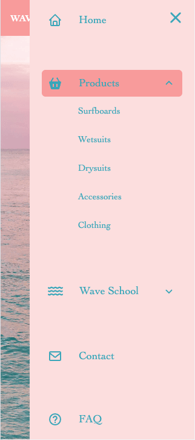
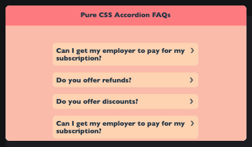

# pure-css-components

img[alt=Logo] { width: 100px; }

## Welcome! 👋

En este repositorio encontrarás componentes creado unicamente con Html y CSS. Son componentes sencillos que servirán como base para tus proyectos web

## Componentes

  - [Drop-down menu mobile](#) 
  <!--  -->
  - [Accordion-FAQ](https://codepen.io/lupeMorales/pen/gOQGvQz) 
<!--    -->

## Contacto

- Website - Visita mi [portfolio web](https://lupemorales.github.io/portfolio/)
- Linkedin - [@LupeMorales](https://www.linkedin.com/in/lupe-morales/)

**Let´s have fun coding!** 🚀